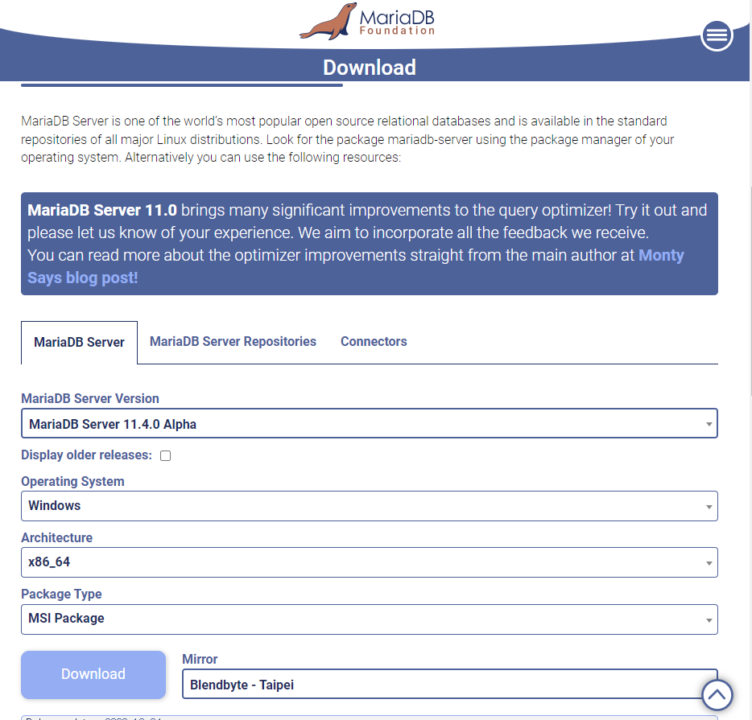

# 데이터베이스 환경구축 (cmd 명령어)

윈도우 MARIA DB 환경구축 

1. 다운로드 받기!

    

2. cmd 켜서 db 구축 명령하기
- cd : 경로를 이동
- . : 현재경로를 나타냄
- .. : 현재경로에서 상위폴더로   
- /w : 목록이 3개씩 표시
- dir : 현재 경로의 폴더 (디렉토리) 와 파일목록을 보여준다.
- tab : 경로를 입력할 때 입력한 문자에 대한 유사한 폴더를 입력해준다.
- cls : 화면을 지움
- sc star MariaDB : Maria db 실행시킨다.
- sc stop MariaDB : Maria db 종료시킨다.
- exit : 명령 프롬포트 창을 종료시킨다.
- 파일 주소에 cmd를 치면 바로 그 파일경로에서 cmd가 시작된다.
- —help : Usage: mysql_install_db.exe [OPTIONS]
    - ?, --help Display this help message and exit.
    - -d, --datadir=name Data directory of the new database
    - -S, --service=name Name of the Windows service
    - -p, --password=name Root password
    - -P, --port=# mysql port
    - -W, --socket=name named pipe name (if missing, it will be set the same asservice)
    - -D, --default-user Create default user
    - -R, --allow-remote-root-access  Allows remote access from network for user root
    - -N, --skip-networking  Do not use TCP connections, use pipe instead
    - -i, --innodb-page-size=#  Page size for innodb
    - -s, --silent Print less information
    - -o, --verbose-bootstrap Include mysqld bootstrap output
    - -l, --large-pages Use large pages
    - -c, --config=name my.ini config template file
- -S MariaDB -p 0000

## 원격접속

- 원격에 데이터베이스 서버에 접속을 하기 위한 정보
    - 주소(IP) : 168.126.63.1 (www.zerobase.co.kr)
    - 내컴퓨터(로컬) : 127.0.01  ,localhost
    - 포트(port) : 3306
    - 계정
    - 비밀번호
    - 인스턴스
- Xshell 설치