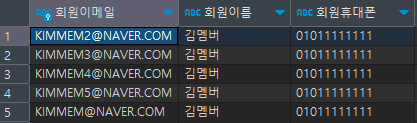
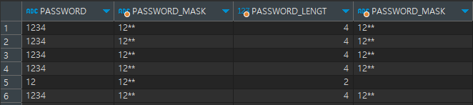

# alias, join, 내장함수

## 1. ALIAS, *

- 별명 : 쉽게 사용하기 위함
- AS 키워드를 이요해서 사용가능 (옵션사항)
- * : 모든 컬럼을 말함 ( 연산에 사용될때는 곱하기 )
- DESC 테이블명 : 테이블정보를 알 수 있다.

```sql
SELECT
	    M.EMAIL AS 회원이메일
    , M.NAME AS 회원이름
    , M.MOBILE_NO 회원휴대폰
FROM `member` M
```
<p align = "left">
    
</p>

## 2. JOIN 문

- 2개 이상의 테이블을 연결해서 데이터를 출력
- 일반적인 경우 PK, FK 연관에 의해 조인성립가능
- 하지만 특별한 경우에는 PK, FK 관계가 없어도 논리적인 값들의 연관만으로 조인가능
- 2개의 조인의 결과집합을 다시 나머지 테이블과 JOIN 가능 이때 내부 JOIN순서는 내부적으로 옵티마이저가 정함

### INNER JOIN

- 조건에 맞는 교집합데이터만 나온다.

```sql
SELECT A.*, B.*
FROM MEMBER A
JOIN MEMBER_DETAIL B
	ON A.MEMBER_TYPE = B.MEMBER_TYPE 
 AND A.USER_ID = B.USER_ID 
```

### FULL JOIN

- 모든 합집합 데이터 값이 나온다.
- 조건을 줄 필요가 없다.

### LEFT JOIN

- 조건에 맞는 LEFT TABLE의 값만 가져온다.

### RIGTH JOIN

- 조건에 맞는 RIGHT TABLE의 값만 가져온다.

## 3. DBMS 내장함수 ( 단일 행 함수 )

- 내장함수, 그 외 사용자가 정의하는 사용자 정의 함수가 있다.
- 대부분 데이터베이스에서 제공하는 함수들

### 3.1 문자형 함수

- 문자를 입력하면 문자나 숫자 값을 반환
- **`CONCAT(string1, string2, ...)`** : 문자열을 결합합니다.
    
    ```sql
    SELECT CONCAT('Hello', ' World'); -- 결과: 'Hello World
    ```
    
- **`LENGTH(string)`**: 문자열의 길이를 반환합니다.
    
    ```sql
    SELECT LENGTH('Hello World'); -- 결과: 11
    ```
    
- **`SUBSTRING(string, start, length)`**: 문자열의 특정 부분을 반환합니다.
    
    ```sql
    SELECT SUBSTRING('Hello World', 1, 5); -- 결과: 'Hello'
    ```
    
- **`UPPER(string)`** / **`LOWER(string)`**: 문자열을 대문자 또는 소문자로 변환합니다.
    
    ```sql
    SELECT UPPER('Hello World'); -- 결과: 'HELLO WORLD'
    SELECT LOWER('Hello World'); -- 결과: 'hello world'
    ```
    
- 실습
    
    ```sql
    SELECT 
    	 PASSWORD 
    	,CONCAT(SUBSTRING(PASSWORD, 1, 2), '**') AS PASSWORD_MASK
    	,LENGTH(PASSWORD) AS PASSWORD_LENGT
    	,CASE WHEN LENGTH(PASSWORD) > 2 THEN CONCAT(SUBSTRING(PASSWORD, 1, 2), '**')
    		  ELSE ''
    		  END AS PASSWORD_MASK  
    FROM MEMBER
    ```
    <p align = "left">
        
    </p>
    

### 3.2 숫자형 함수

- 숫자를 입력하면 숫자 값을 반환
- **`ROUND(number, digits)`**: 숫자를 반올림합니다.
    
    ```sql
    SELECT ROUND(123.4567, 2); -- 결과: 123.46
    ```
    
- **`FLOOR(number)`** / **`CEIL(number)`**: 숫자를 내림 또는 올림합니다.
    
    ```sql
    SELECT FLOOR(123.4567); -- 결과: 123
    SELECT CEIL(123.4567); -- 결과: 124
    ```
    

### 3.3 날짜형 함수

- DATE 타입의 값을 연산
- **`NOW()`**: 현재 날짜와 시간을 반환합니다.
    
    ```sql
    SELECT NOW(); -- 결과: '2024-01-22 12:34:56'
    ```
    
- **`DATE_ADD(date, INTERVAL expr unit)`**: 날짜에 특정 시간을 더합니다.
    
    ```sql
    SELECT DATE_ADD('2024-01-22', INTERVAL 1 DAY); -- 결과: '2024-01-23'
    ```
    
- **`DATEDIFF(date1, date2)`**: 두 날짜 사이의 차이(일수)를 반환합니다.
    
    ```sql
    SELECT DATEDIFF('2024-01-22', '2024-01-01'); -- 결과: 21
    ```
    

### 3.4 변환형 함수

- 문자, 숫자, 날짜형 값의 데이터 타입을 다른 유형으로 반환
- **`CAST(expression AS type)`**
    
    ```sql
    SELECT CAST('123' AS INT); -- 결과: 123
    ```
    

### 3.5 NULL 관련 함수

- NULL을 처리하기 위한 함수.
- **`COALESCE(value1, value2, ...)`**: 주어진 값 중 첫 번째 NULL이 아닌 값을 반환합니다.
    
    ```sql
    SELECT COALESCE(NULL, NULL, 'Hello', 'World'); -- 결과: 'Hello'
    ```
    
- **`IFNULL(expression, alt_value)`**: 첫 번째 인자가 NULL일 경우 대체 값을 반환합니다.
    
    ```sql
    SELECT IFNULL(NULL, 'Hello World'); -- 결과: 'Hello World'
    ```