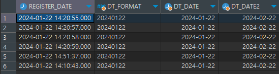
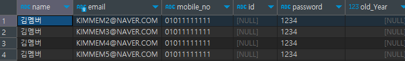

# 데이터 표시 포맷, 페이징 처리

## 1. 데이터 표시 포맷

- 날짜 → 문자열
- 문자열 → 날짜
    
    ```sql
    SELECT 
    	  REGISTER_DATE
    	, DATE_FORMAT(REGISTER_DATE, '%Y%m%d') AS DT_FORMAT --날짜 -> 문자열
    	, STR_TO_DATE('20240122','%Y%m%d') AS DT_DATE -- 문자열 -> 날짜
    	, DATE_ADD(STR_TO_DATE('20240122','%Y%m%d'), INTERVAL 1 MONTH) AS DT_DATE2 
    FROM MEMBER
    ```
    
    <p align = "left">
    
    </p>
    

## 2. 페이징 처리

- 데이터는 엄청 많고 한꺼번에 데이터를 볼 수 없기 때문에 특정위치부터 특정개수까지 내려줌
- MYSQL, MARIADB : **LIMIT** 페이징처리가능
    
    ```sql
    SELECT *
    FROM MEMBER
    LIMIT 0, 4
    ```
    <p align = "left">
    
    </p>
    
- ORACLE : **ROWNUM** 페이징처리
- MSSQL : **OFFSET, FETCH** 페이징처리