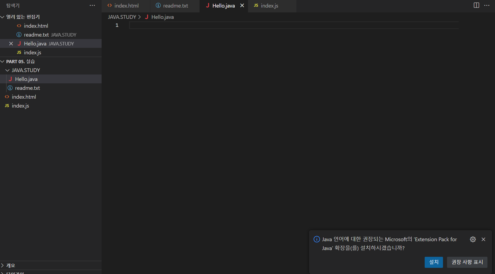
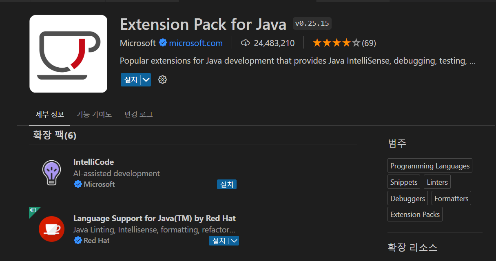

# JVM(자바가상머신), 개발환경 구축

# 1. JVM

- JAVA Virtual Machine, 자바 애플리케이션을 실행시키기 위한 가상 컴퓨터 환경
- os에 종속받지 않고 cpu가 java를 인식, 실행할 수 있게 하는 가상컴퓨터이다.
- [Hello.java](http://Hello.java) 자바프로그램 → 컴파일러 → [Hello.](http://Hello.Java)Class 바이트코드 → 윈도우용, 리눅스용, 맥용 JVM → 각 실행파일 → 각 pc

## 2. 자바개발환경구축 ( visual studio code )

- 자바 파일 생성시 자바 확장 설치 프로그램으로 연결하게 해준다.

    

    

- 설치 후 다시 visual studio 접속
- [HELLO.JAVA](http://HELLO.JAVA) 에 클래스 만들고 MAIN 실행후 확인